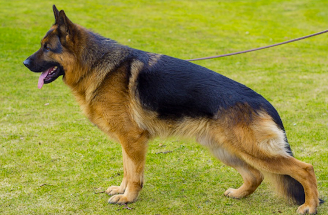
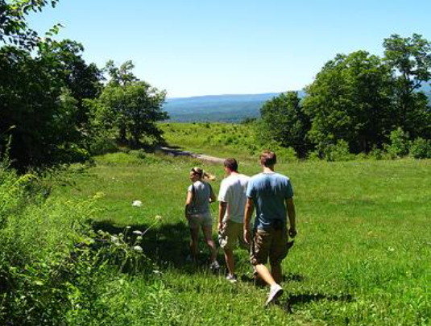
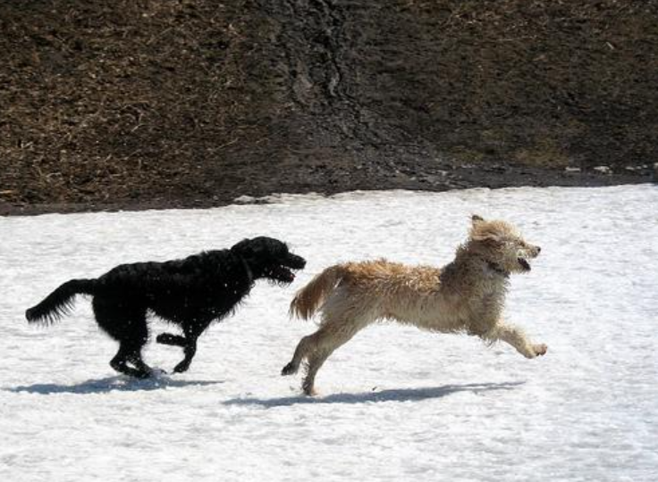

# Vision-GPT: Multimodal Image Captioning

A lightweight multimodal model combining GPT-2 and Vision Transformer for image captioning, built for **Smart India Hackathon 2025**.

## 🎯 Architecture

**Sparse Cross-Attention Fusion** (inspired by Llama 3.2)

- **GPT-2** (124M params) - Language model backbone ❄️ frozen
- **ViT-B/16** (87M params) - Visual encoder ❄️ frozen  
- **Cross-Attention** (11M params) - Vision-language fusion 🔥 trainable
  - Inserted at layers 3, 6, 9
  - Perceiver Resampler for efficient visual token compression

**Total**: 222M params | **Trainable**: 11M params (5%)

## 📊 Training

- **Dataset**: Flickr8k
- **Epochs**: 2
- **Final Loss**: 2.632
- **Strategy**: Freeze pretrained models, train only cross-attention layers

## 🖼️ Example Results

<table>
  <tr>
    <td align="center">
      
       
      <em>"A man is riding a motorbike on a scenic road."</em>
    </td>
    <td align="center">
      
       
      <em>"a black race car running on a track"</em>
    </td>
    <td align="center">
      
       
      <em>"The German shepherd dog is walking in the grass."</em>
    </td>
  </tr>
  <tr>
    <td align="center">
      
       
      <em>"Three people stand near a group of trees."</em>
    </td>
    <td align="center">
      
       
      <em>"A soccer player in red stands in the stands and looks up."</em>
    </td>
    <td align="center">
      
       
      <em>"The two dogs play in the snow."</em>
    </td>
  </tr>
</table>

## 🎨 Demo

Try it on Hugging Face Spaces: [Multimodal GPT-2 Demo](https://huggingface.co/spaces/gurumurthy3/Multimodal-Gpt2-Demo)