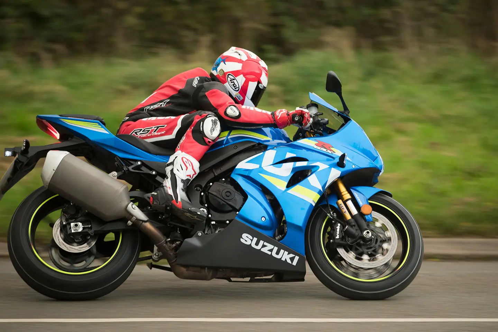
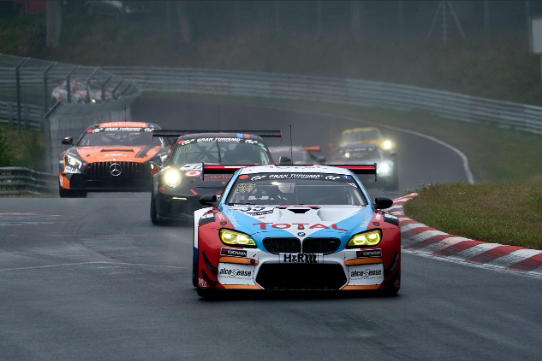
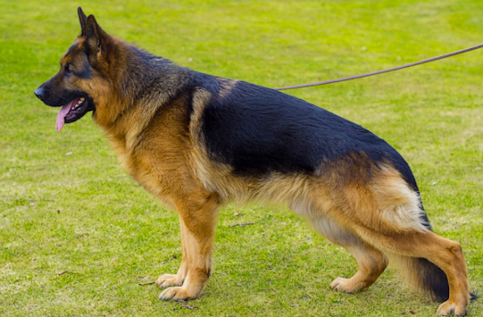
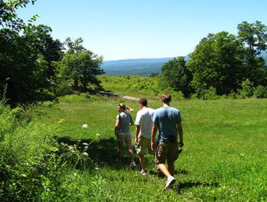
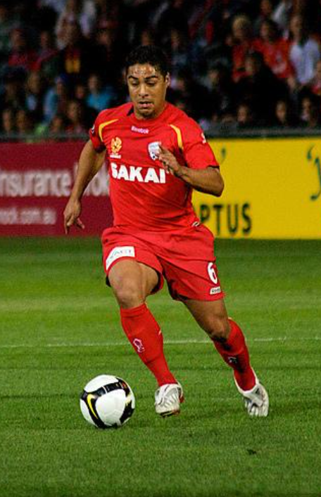
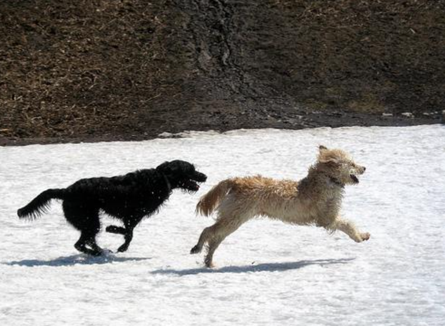

# Multimodal GPT-2 — Version 1 (V1 Baseline)

This directory contains **Version 1 (V1)** of the multimodal GPT-2 image captioning model built for **Smart India Hackathon 2025**.

V1 serves as the initial proof-of-concept for fusing a frozen Vision Transformer (ViT-B/16) with a frozen GPT-2 language model using a trainable Perceiver Resampler and sparse cross-attention layers.

---

## 🎯 Architecture Overview

```
Image (224x224) ──► ViT-B/16 (Frozen, 87M) ──► Patch Tokens (196 x 768)
                                                     │
                                             Perceiver Resampler (Trainable, 2 Layers)
                                                     │
                                             Visual Context (64 x 768)
                                                     │
Text Prompt ──────► GPT-2 Small (Frozen, 124M) ◄─────┴── Cross-Attention (Trainable, Layers 3, 6, 9)
                                                     │
                                             Next-Token Logits
```

* **Language Model Backbone**: GPT-2 Small (124M parameters, 12 layers, 12 attention heads, hidden dim 768) — ❄️ **Frozen**.
* **Vision Encoder**: `vit_b_16` (ImageNet-1K pretrained, 87M parameters) — ❄️ **Frozen**.
* **Perceiver Resampler**: 64 latent tokens, 2 cross-attention blocks, 8 heads — 🔥 **Trainable**.
* **Sparse Cross-Attention**: Inserted before GPT-2 layers 3, 6, and 9 — 🔥 **Trainable**.

### Parameter Breakdown
* **Total Parameters**: 222,092,520 (~222M)
* **Trainable Parameters**: 11,084,288 (~11.08M / 5.0% of total)

---

## 📊 Dataset & Training Setup

* **Dataset**: Flickr8k (loaded via Parquet splits: test, train 1/2, train 2/2, val) — 8,000 images $\times$ 5 captions = 40,000 total training samples.
* **Batch Size**: 16
* **Context Length**: 256 tokens
* **Optimizer**: AdamW ($\text{LR} = 1\times 10^{-4}$, weight decay $0.01$, $\beta_1=0.9, \beta_2=0.999$)
* **Epochs**: 2
* **Final Training Loss**: **2.6757** (Epoch 1: 3.3109 $\rightarrow$ Epoch 2: 2.6757)

---

## 🖼️ Example Output Captions

The model was tested on held-out dataset images with autoregressive top-$k$ / top-$p$ nucleus sampling (`temperature=1.0`, `top_k=50`, `top_p=0.9`):

<table>
  <tr>
    <td align="center">
      
      <br/>
      <em>"A man is riding a motorbike on a scenic road."</em>
    </td>
    <td align="center">
      
      <br/>
      <em>"a black race car running on a track"</em>
    </td>
    <td align="center">
      
      <br/>
      <em>"The German shepherd dog is walking in the grass."</em>
    </td>
  </tr>
  <tr>
    <td align="center">
      
      <br/>
      <em>"Three people stand near a group of trees."</em>
    </td>
    <td align="center">
      
      <br/>
      <em>"A soccer player in red stands in the stands and looks up."</em>
    </td>
    <td align="center">
      
      <br/>
      <em>"The two dogs play in the snow."</em>
    </td>
  </tr>
</table>

Live Interactive Demo: [Hugging Face Spaces — Multimodal GPT-2 Demo](https://huggingface.co/spaces/gurumurthy3/Multimodal-Gpt2-Demo)

---

## 🚀 How to Run

1. Open [`trained_model.ipynb`](trained_model.ipynb) in Google Colab or a local Jupyter environment with GPU enabled (`cuda`).
2. Run cells sequentially:
   - Dependencies (`datasets`, `torchvision`, `transformers`, `matplotlib`) will auto-install/load.
   - ViT-B/16 and GPT-2 Small pretrained weights will download automatically.
   - Flickr8k Parquet dataset will stream via Hugging Face `datasets`.
3. Model training takes ~15–20 minutes on an NVIDIA T4 GPU.
4. Serialized weights and tokenizer files are saved to `./vision_gpt_model/`.

---

## ⚠️ Known Limitations of V1

1. **Ungated Cross-Attention**: Cross-attention layers are standard additive residuals ($x + \text{CrossAttn}(x)$). Randomly initialized cross-attention weights disturb pretrained GPT-2 text generation capabilities at step 0.
2. **Small Dataset**: Flickr8k contains only 8,000 images, limiting visual domain generalization.
3. **No Quantitative Validation Suite**: Lacks automated BLEU or METEOR scoring on a held-out test split.
4. **No Resume Capabilities**: Training cannot resume from mid-epoch interruptions.

These limitations motivated the complete architectural redesign in [Version 2 (V2)](../v2/).